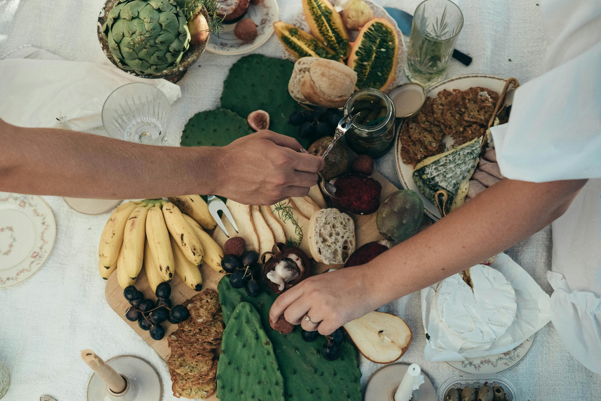

# Tropical Eats🥘
##

A recipe website for caribbeans, built with *HTML/CSS*. Jaiye Time!

## Getting Started
#### You can clone or download this repository to your local machine using the link below:
https://github.com/munachi-v/Tropicaleats

### Built with 
  - CSS - A utility-first CSS framework
  - Hero Patterns - A collection of repeatable SVG background patterns for websites
  - Hero Icons - A collection of UI icons for web projects
  
  ## Authors
  - SAGE - Project Lead - Munachi-V